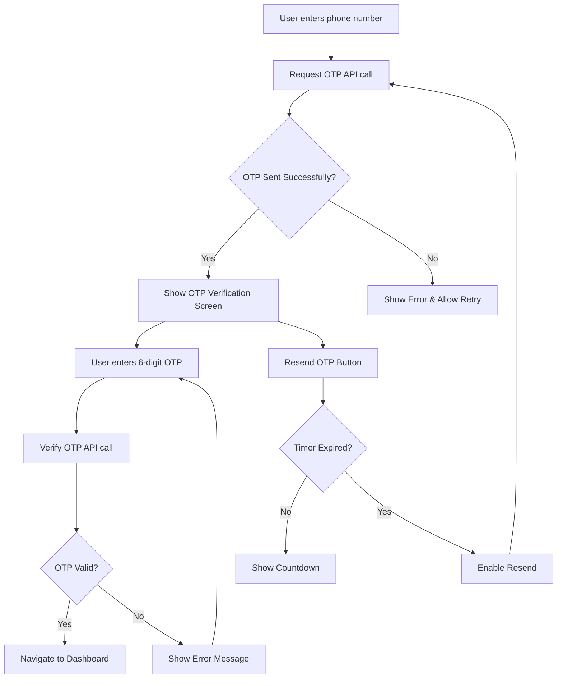

# OTP Verification UI Design Document

## 1. Overview

This document outlines the design for implementing an OTP (One-Time Password) verification screen in the grocery app. The feature will integrate with the Fast2SMS API to send verification codes to users' mobile phones during the login process. The UI will be minimal and consistent with the existing app design.

The OTP screen will appear as a **new screen** in the authentication flow. After the customer enters their mobile number on the existing CustomerLogin screen and taps "Continue", they will be navigated to the new OTP verification screen.

## 2. Requirements

### Functional Requirements
- Display a 6-digit OTP input interface
- Allow users to enter OTP manually
- Provide visual feedback for each digit entered
- Enable OTP verification against the backend
- Include a resend OTP functionality with countdown timer
- Handle success and error states appropriately

### Non-Functional Requirements
- UI consistency with existing app design
- Responsive design for different screen sizes
- Minimal loading states during API calls
- Proper error handling and user feedback
- Accessibility compliance

## 3. Implementation Plan

### File Structure
- Create `OTPVerification.tsx` in `src/features/auth/`
- Add route to `Navigation.tsx`
- Update `CustomerLogin.tsx` to navigate to OTP screen after phone number entry

## 4. Design Specifications

### UI Components
- Header with verification title and icon
- Subtitle with phone number display
- 6-digit OTP input boxes
- Primary "Verify OTP" button
- Secondary "Resend OTP" button with timer
- Loading indicators during API calls

### Color Scheme
- Primary color: #4CAF50 (consistent with app's primary color)
- Border color: #E0E0E0 (for empty inputs)
- Active border color: #4CAF50 (for filled inputs)
- Error color: #F44336 (for invalid states)
- Background: #FFFFFF (white)

### Error Feedback
- Invalid OTP inputs will trigger a shake animation on the OTP boxes
- Border color will change to red (#F44336) for invalid inputs
- Error message will be displayed below the OTP input boxes
- Visual feedback will be immediate and clear to the user

### Typography
- Title: Bold, 24px
- Subtitle: Regular, 16px
- OTP digits: Bold, 20px
- Button text: Medium, 16px
- Helper text: Regular, 14px

## 5. User Flow



## 6. Screen Placement and Navigation

The OTP verification screen will be implemented as a **separate screen** in the authentication flow, not integrated with the existing CustomerLogin screen. Here's exactly how the flow will work:

1. User opens the app and lands on the CustomerLogin screen (existing screen)
2. User enters their 10-digit mobile number in the input field
3. User taps the "Continue" button
4. App makes an API call to request an OTP from the backend
5. If OTP request is successful, user is **navigated to a new screen** (OTPVerification)
6. On the OTPVerification screen, user enters the 6-digit code they received via SMS
7. User taps "Verify OTP" to complete authentication
8. Upon successful verification, user is taken to the main dashboard

This approach maintains separation of concerns and follows the existing navigation pattern in the app where each distinct step in a process has its own screen. The OTP screen is not integrated into the CustomerLogin screen but is a completely separate screen that appears after the user submits their phone number.

### OTPVerification Component

The OTPVerification component will be implemented as a functional React component using React Native. It will include:

1. State management for OTP digits, loading states, and timer
2. Refs for handling focus between OTP input boxes
3. Integration with the Fast2SMS API through backend endpoints
4. Navigation handling using React Navigation

### Key Functions

- `handleOtpChange`: Updates OTP state when user types
- `handleKeyPress`: Manages backspace navigation between inputs
- `handleVerifyOTP`: Sends OTP to backend for verification
- `handleResendOTP`: Requests a new OTP from the backend
- Timer effect for resend countdown

### Integration Points

- `customerLogin` service for initial phone number submission
- `/auth/otp/request` endpoint for OTP generation
- `/auth/otp/verify` endpoint for OTP verification
- Auth store for managing user authentication state

## 7. Component Architecture

### OTPVerification Component
- **Props**: 
  - phone: string (phone number to verify)
- **State**:
  - otp: array of 6 strings (individual digits)
  - loading: boolean (API call state)
  - timer: number (resend countdown)
  - canResend: boolean (resend button state)
- **Refs**:
  - inputRefs: array of refs for OTP input boxes

### Component Structure
```
OTPVerification
├── SafeAreaView
├── View (container)
│   ├── Icon (shield-checkmark)
│   ├── CustomText (title)
│   ├── CustomText (subtitle with phone)
│   ├── View (OTP container)
│   │   ├── 6x View (OTP boxes)
│   │   │   ├── CustomText (digit display)
│   │   │   ├── View (input border)
│   │   │   └── input (hidden native input)
│   ├── View (button container)
│   │   └── CustomButton (Verify OTP)
│   └── View (resend container)
│       ├── CustomText (resend text)
│       └── CustomButton (Resend OTP)
```

## 8. API Integration

### Request OTP Endpoint
- **URL**: `/api/auth/otp/request`
- **Method**: POST
- **Body**: `{ phone: string }`
- **Response**: 
  ```json
  {
    "success": boolean,
    "message": string,
    "requestId": string
  }
  ```

### Verify OTP Endpoint
- **URL**: `/api/auth/otp/verify`
- **Method**: POST
- **Body**: 
  ```json
  {
    "phone": string,
    "otp": string
  }
  ```
- **Response**:
  ```json
  {
    "success": boolean,
    "message": string,
    "token": {
      "accessToken": string,
      "refreshToken": string
    },
    "user": object
  }
  ```

## 9. State Management

### Local Component State
- OTP digits (6-character array)
- Loading state for API calls
- Resend timer countdown
- Resend button enable/disable state

### Global State (Zustand)
- User authentication state
- Access and refresh tokens

## 10. Error Handling

### OTP Request Errors
- Network failures
- Rate limiting
- Invalid phone number
- SMS provider issues

### OTP Verification Errors
- Invalid OTP
- Expired OTP
- Too many attempts
- Network failures

### User Feedback
- Alert dialogs for critical errors
- Inline error messages for validation
- Loading indicators during processing
- Success confirmation on verification

### Visual Error Feedback Implementation
When a user enters an incorrect OTP and submits it, the following visual feedback will be provided:

1. **Shake Animation**: The OTP input boxes will perform a horizontal shake animation to indicate an error
2. **Border Color Change**: The border of all OTP boxes will change to red (#F44336) to visually indicate an error state
3. **Error Message**: A clear error message will be displayed below the OTP input boxes
4. **Duration**: The visual feedback will be displayed for 2-3 seconds before returning to the normal state

This will be implemented using React Native Reanimated for smooth, performant animations that provide clear feedback to the user without being distracting.

## 11. Security Considerations

- OTPs are never displayed in logs
- Input masking for OTP fields
- Rate limiting on verification attempts
- Token storage in secure storage
- Automatic logout on token expiration

## 12. Performance Considerations

- Minimal re-renders with proper state management
- Efficient focus management between OTP inputs
- Optimized API calls with proper error handling
- Keyboard-aware layout adjustments

## 13. Accessibility

- Proper contrast ratios for text and backgrounds
- Screen reader support for all interactive elements
- Keyboard navigation support
- Focus indicators for interactive elements

## 14. Testing Strategy

### Unit Tests
- OTP input handling
- Timer functionality
- API integration functions
- Error state management

### Integration Tests
- Full OTP flow from request to verification
- Resend functionality
- Navigation after successful verification

### UI Tests
- Component rendering
- Responsive design
- User interaction flows
- Error state displays

## 15. Integration with Fast2SMS

Based on the Fast2SMS integration debug summary, the OTP service will use the standard OTP route which automatically uses sender ID "OTP". The integration will follow these principles:

1. Use the standard OTP route (`route=otp`) rather than DLT manual route
2. No custom sender_id parameter needed
3. Proper error handling for DND blocked numbers
4. Configuration validation to ensure correct route selection
5. Logging for debugging OTP delivery issues

The backend service is already configured to work with Fast2SMS, so the frontend only needs to integrate with the existing API endpoints.

## 16. Integration with CustomerLogin

To integrate the OTP verification flow with the existing CustomerLogin screen:

1. Modify the `handleAuth` function in `CustomerLogin.tsx` to request an OTP instead of directly logging in
2. Navigate to the OTPVerification screen after successful OTP request
3. Pass the phone number as a parameter to the OTPVerification screen

Example modification to `CustomerLogin.tsx`:

```javascript
const handleAuth = async () => {
  Keyboard.dismiss()
  setLoading(true)
  try {
    // Request OTP instead of direct login
    const response = await axios.post(`${BASE_URL}/auth/otp/request`, { 
      phone: phoneNumber 
    })
    
    if (response.data.success) {
      // Navigate to OTP verification screen
      navigation.navigate('OTPVerification', { phone: phoneNumber })
    } else {
      Alert.alert("Error", response.data.message || "Failed to send OTP")
    }
  } catch (error) {
    Alert.alert("Error", "Failed to send OTP")
  } finally {
    setLoading(false)
  }
}
```

## 17. Navigation Integration

Add the OTPVerification screen to the navigation stack in `Navigation.tsx`:

```javascript
// Import the component
import OTPVerification from '@features/auth/OTPVerification';

// Add to the Stack.Navigator
<Stack.Screen 
  name="OTPVerification" 
  component={OTPVerification} 
  options={{
    animation: 'slide_from_right',
  }}
/>
```