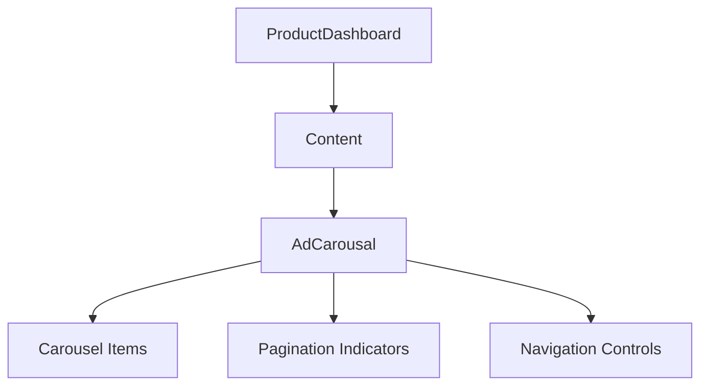

# Product Dashboard Ad Carousel Enhancement Design

## Overview
This document outlines the design and implementation plan for enhancing the aesthetics and functionality of the Ad Carousel/Banner component in the Product Dashboard UI. The current implementation is functional but lacks visual appeal and modern UI elements that would make it more engaging for users.

## Current State Analysis

### Component Structure
The Ad Carousel is implemented in `src/components/dashboard/AdCarousal.tsx` and integrated into the dashboard through:
- `src/components/dashboard/Content.tsx` (direct import)
- `src/features/dashboard/ProductDashboard.tsx` (through Content component)

### Key Issues Identified
1. **Visual Design**: Basic styling with minimal visual appeal
2. **User Feedback**: No pagination indicators or visual cues for multiple slides
3. **Interaction**: Limited user interaction capabilities
4. **Animation**: Basic auto-scroll without smooth transitions
5. **Responsiveness**: Fixed dimensions that may not adapt well to all screen sizes

## Overview
This document outlines the design and implementation plan for enhancing the aesthetics and functionality of the Ad Carousel/Banner component in the Product Dashboard UI. The current implementation is functional but lacks visual appeal and modern UI elements that would make it more engaging for users.

## Current State Analysis

### Component Structure
The Ad Carousel is implemented in `src/components/dashboard/AdCarousal.tsx` and integrated into the dashboard through:
- `src/components/dashboard/Content.tsx` (direct import)
- `src/features/dashboard/ProductDashboard.tsx` (through Content component)

### Key Issues Identified
1. **Visual Design**: Basic styling with minimal visual appeal
2. **User Feedback**: No pagination indicators or visual cues for multiple slides
3. **Interaction**: Limited user interaction capabilities
4. **Animation**: Basic auto-scroll without smooth transitions
5. **Responsiveness**: Fixed dimensions that may not adapt well to all screen sizes

## Proposed Enhancements

### 1. Visual Design Improvements
- Implement gradient overlays for better text readability
- Add subtle shadows and depth effects
- Improve border radius consistency
- Add smooth transition animations between slides
- Implement a modern color scheme that aligns with the app's branding

### 2. Pagination and Navigation
- Add dot indicators to show current slide position
- Implement swipe gestures for manual navigation
- Add arrow buttons for desktop-like navigation (if applicable)
- Include slide counter (e.g., "1/5")

### 3. Animation and Transitions
- Replace basic scroll animation with smooth fade or slide transitions
- Add parallax effect for background images
- Implement entrance animations for slide content
- Add hover effects (where applicable)

### 4. Responsiveness and Adaptability
- Implement dynamic sizing based on screen dimensions
- Add aspect ratio preservation for images
- Create adaptive layouts for different device orientations
- Ensure proper spacing on all screen sizes

## Technical Implementation Plan

### Component Structure


### Enhanced Component Architecture
1. **Main Carousel Container**
   - Responsive width and height
   - Shadow effects and rounded corners
   - Background gradient overlay

2. **Slide Items**
   - Image with proper aspect ratio
   - Content overlay with text information
   - Call-to-action buttons

3. **Pagination System**
   - Interactive dot indicators
   - Slide counter display
   - Active state highlighting

4. **Navigation Controls**
   - Previous/Next arrow buttons
   - Auto-play toggle
   - Swipe gesture support

### Styling Improvements
#### Before (Current Implementation)
```typescript
const styles = StyleSheet.create({
  carouselContainer: {
    marginTop: 8,
    marginBottom: 0,
    marginHorizontal: 12,
    borderRadius: 12,
    backgroundColor: '#fff',
    shadowColor: '#000',
    shadowOffset: {
      width: 0,
      height: 2,
    },
    shadowOpacity: 0.1,
    shadowRadius: 4,
    elevation: 3,
  },
  imageContainer: {
    width: screenWidth - 24,
    height: 140,
    borderRadius: 12,
    overflow: 'hidden',
  },
  img: {
    width: '100%',
    height: '100%',
    resizeMode: 'cover',
  },
});
```

#### After (Proposed Enhancement)
```typescript
const styles = StyleSheet.create({
  carouselContainer: {
    marginTop: 12,
    marginBottom: 8,
    marginHorizontal: 16,
    borderRadius: 16,
    backgroundColor: '#fff',
    shadowColor: '#000',
    shadowOffset: {
      width: 0,
      height: 4,
    },
    shadowOpacity: 0.15,
    shadowRadius: 8,
    elevation: 5,
    overflow: 'hidden',
  },
  imageContainer: {
    width: screenWidth - 32,
    height: 160,
    borderRadius: 16,
    overflow: 'hidden',
  },
  img: {
    width: '100%',
    height: '100%',
    resizeMode: 'cover',
  },
  overlay: {
    ...StyleSheet.absoluteFillObject,
    backgroundColor: 'rgba(0, 0, 0, 0.3)',
    borderRadius: 16,
  },
  contentContainer: {
    ...StyleSheet.absoluteFillObject,
    padding: 20,
    justifyContent: 'flex-end',
  },
  title: {
    color: '#fff',
    fontSize: 20,
    fontWeight: 'bold',
    marginBottom: 8,
  },
  description: {
    color: '#fff',
    fontSize: 14,
    marginBottom: 12,
  },
  paginationContainer: {
    flexDirection: 'row',
    justifyContent: 'center',
    alignItems: 'center',
    paddingVertical: 12,
  },
  dot: {
    width: 8,
    height: 8,
    borderRadius: 4,
    backgroundColor: 'rgba(255, 255, 255, 0.5)',
    marginHorizontal: 4,
  },
  activeDot: {
    backgroundColor: '#fff',
    width: 10,
    height: 10,
    borderRadius: 5,
  },
});
```

## Functional Improvements

### 1. Enhanced Auto-scroll
- Implement configurable auto-scroll interval
- Add pause on user interaction
- Smooth transition animations

### 2. Manual Navigation
- Touch/swipe gesture support
- Previous/Next button controls
- Direct dot indicator tapping

### 3. Performance Optimizations
- Image caching for smoother loading
- Lazy loading for off-screen slides
- Memory optimization for large carousels

## Integration Considerations

### Compatibility
- Maintain existing props interface (`adData`)
- Preserve current functionality while adding enhancements
- Ensure backward compatibility with existing code

### Dependencies
- Continue using existing libraries (no new dependencies)
- Leverage existing UI components (CustomText, ScalePress)
- Utilize existing styling utilities

### Testing
- Verify carousel functionality on different screen sizes
- Test auto-scroll and manual navigation
- Validate pagination indicators
- Check performance with multiple slides

## UI/UX Enhancements

### Visual Hierarchy
1. **Primary Focus**: Promotional content with clear call-to-action
2. **Secondary Elements**: Supporting text and branding
3. **Navigation Controls**: Subtle but accessible

### Accessibility
- Ensure proper contrast ratios for text overlays
- Implement screen reader support for slide content
- Add keyboard navigation support
- Provide alternative text for images

### Animation Principles
- Use easing functions for natural movement
- Maintain consistent timing across transitions
- Avoid excessive animations that may cause motion sickness

## Implementation Steps

### Phase 1: Visual Enhancement
1. Update styling with improved shadows, rounded corners, and spacing
2. Add gradient overlays for better text readability
3. Implement pagination indicators

### Phase 2: Interaction Improvements
1. Add swipe gesture support
2. Implement previous/next navigation controls
3. Enhance auto-scroll functionality

### Phase 3: Performance Optimization
1. Add image caching mechanism
2. Implement lazy loading for slides
3. Optimize rendering performance

## Risk Assessment

### Potential Issues
1. **Performance Impact**: Additional animations and effects may affect performance on lower-end devices
2. **Layout Conflicts**: New styling may conflict with existing layout constraints
3. **Image Loading**: Enhanced carousel may require more robust image handling

### Mitigation Strategies
1. Implement performance monitoring and optimization
2. Thoroughly test on various device configurations
3. Add proper error handling for image loading failures

## Success Metrics

### Visual Improvements
- Enhanced user engagement with carousel content
- Improved aesthetic appeal based on user feedback
- Consistent design language with rest of the application

### Functional Improvements
- Smooth navigation between slides
- Responsive interaction with user inputs
- Reliable auto-scroll functionality

### Performance Metrics
- Maintained frame rate during transitions
- Reduced memory consumption
- Fast loading times for carousel content